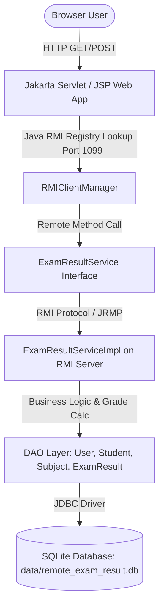
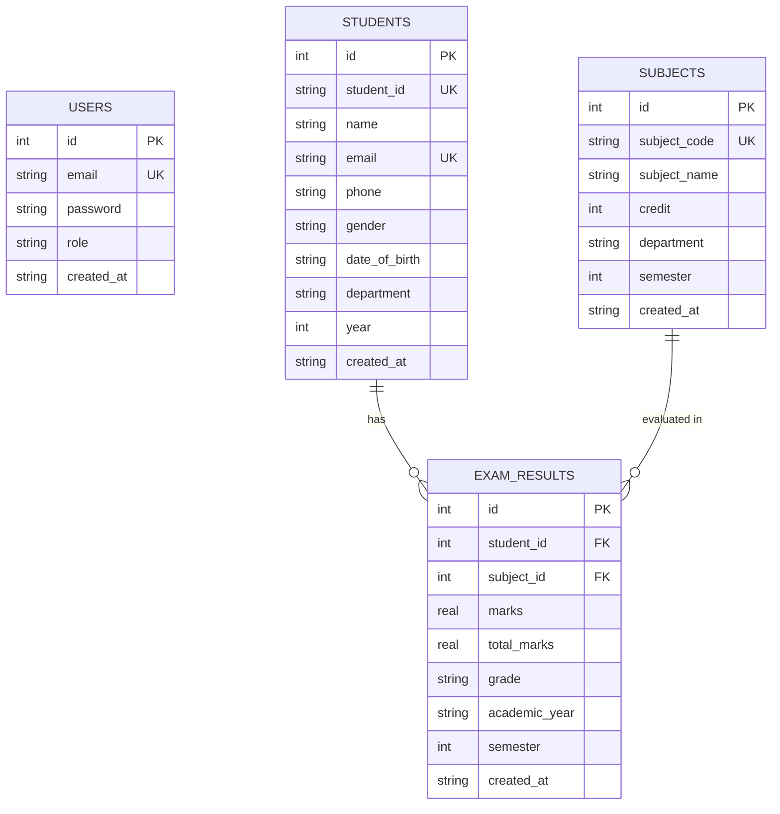

# Remote Exam Result Management System using Java RMI

A complete, enterprise-grade university management project demonstrating **Java Remote Method Invocation (Java RMI)** as the core communication layer between a **Jakarta Servlet/JSP** web application and a dedicated **RMI Server** managing business logic and **SQLite** persistence.

---

## 🌟 Features

### 🔐 Authentication & Authorization
- **Role-Based Access Control**: Separate portals for `ADMIN` and `STUDENT`.
- **BCrypt Password Hashing**: Passwords stored as salted BCrypt hashes (no plain-text storage).
- **Session Security**: Session invalidation on logout and strict URL protection via Jakarta Servlet Filter (`AuthFilter`).
- **Student Privacy Protection**: Students can **ONLY** view their own results bound to their session email (no parameter tampering by ID in URL).

### 👨‍💼 Admin Management Capabilities
- **Dashboard Overview**: Live counter stats (Total Students, Subjects, Results) and recent exam evaluations.
- **Student CRUD**: Full creation, viewing, keyword searching, updating, and deletion of student profiles.
- **Subject CRUD**: Management of subject codes, credit values, departments, and semesters.
- **Exam Result CRUD**: Add, update, search, and delete exam records with multi-criteria filtering (Student, Subject, Semester, Academic Year).
- **Automated Grading Engine**: Admins input raw marks and total marks. Grade calculation is performed **exclusively by the RMI Server**.

### 🎓 Student Portal Capabilities
- **Academic Summary**: Overall GPA/percentage, overall grade, total credit count, and Pass/Fail evaluation.
- **Detailed Transcript**: Line-by-line mark breakdown per subject with credit display.
- **Printable Transcripts**: One-click printable transcript view.

---

## 🏗️ System Architecture



### 🛰️ Java RMI Communication Flow
1. **RMI Server Initialization**: The RMI Server initializes the SQLite database, binds `ExamResultServiceImpl` to the local RMI Registry on port `1099` under the key `"ExamResultService"`.
2. **Web Client Connection**: When a user performs an action in the Web App (e.g., login, grade calculation, student lookup), the Jakarta Servlet calls `RMIClientManager.getService()`.
3. **Remote Call Execution**: `RMIClientManager` looks up the stub from `rmi://localhost:1099/ExamResultService` and invokes methods remotely.
4. **Database Decoupling**: The Web Application **never** touches SQLite or JDBC directly.

---

## 🗄️ Database Design

**Database Location**: `data/remote_exam_result.db`  
**Driver**: SQLite JDBC Driver (`org.xerial:sqlite-jdbc`)



### 📊 Grading Scale (Calculated by RMI Server)
| Marks Percentage | Grade | Status |
| :--- | :---: | :---: |
| **90% – 100%** | **A+** | PASS |
| **80% – 89%** | **A** | PASS |
| **75% – 79%** | **B+** | PASS |
| **70% – 74%** | **B** | PASS |
| **65% – 69%** | **C+** | PASS |
| **60% – 64%** | **C** | PASS |
| **50% – 59%** | **D** | PASS |
| **Below 50%** | **F** | **FAIL** |

---

## 📂 Project Structure

```
remote-exam-result-management-system/
├── pom.xml                               # Root Maven POM (Multi-module)
├── README.md                             # Comprehensive documentation
├── .gitignore                            # Excludes .db, target/, secrets, IDE files
│
├── common/                               # Module 1: Shared Interfaces & Models
│   ├── pom.xml
│   └── src/main/java/common/
│       ├── ExamResultService.java        # Remote interface (extends java.rmi.Remote)
│       ├── User.java                     # Serializable User model
│       ├── Student.java                  # Serializable Student model
│       ├── Subject.java                  # Serializable Subject model
│       └── ExamResult.java               # Serializable ExamResult model
│
├── rmi-server/                           # Module 2: RMI Server & Persistence
│   ├── pom.xml
│   └── src/main/java/server/
│       ├── RMIServer.java                # Main class starting RMI registry on port 1099
│       ├── ExamResultServiceImpl.java    # UnicastRemoteObject implementing service & grade logic
│       ├── DatabaseConnection.java       # JDBC Connection manager for SQLite
│       ├── DatabaseInitializer.java      # Automatic schema creation & seed data
│       ├── UserDAO.java                  # User SQL data access
│       ├── StudentDAO.java               # Student SQL data access
│       ├── SubjectDAO.java               # Subject SQL data access
│       └── ExamResultDAO.java            # ExamResult SQL data access with JOIN queries
│
├── web-app/                              # Module 3: Jakarta Servlet & JSP Frontend
│   ├── pom.xml
│   └── src/main/
│       ├── java/web/
│       │   ├── RMIClientManager.java     # Singleton lookup manager for ExamResultService
│       │   ├── LoginServlet.java         # /login controller
│       │   ├── LogoutServlet.java        # /logout controller
│       │   ├── RegisterServlet.java      # /register controller
│       │   ├── AdminDashboardServlet.java# /admin/dashboard controller
│       │   ├── StudentServlet.java       # /admin/students CRUD controller
│       │   ├── SubjectServlet.java       # /admin/subjects CRUD controller
│       │   ├── ExamResultServlet.java    # /admin/results CRUD controller
│       │   ├── StudentDashboardServlet.java# /student/dashboard controller
│       │   ├── StudentResultServlet.java # /student/results controller
│       │   └── AuthFilter.java           # Security filter for authentication & RBAC
│       └── webapp/
│           ├── index.jsp                 # Landing page (redirects to /login)
│           ├── login.jsp                 # Modern glassmorphic login page
│           ├── register.jsp              # Student registration page
│           ├── assets/
│           │   ├── css/style.css         # Dark-sidebar theme & custom components
│           │   └── js/app.js             # Form validation & interactive UI logic
│           └── WEB-INF/
│               ├── web.xml               # Servlet 6.0 deployment descriptor
│               └── views/
│                   ├── admin/
│                   │   ├── sidebar.jsp   # Admin navigation header/sidebar
│                   │   ├── dashboard.jsp # Admin dashboard view
│                   │   ├── students.jsp  # Student management view
│                   │   ├── subjects.jsp  # Subject management view
│                   │   └── results.jsp   # Result management view
│                   ├── student/
│                   │   ├── sidebar.jsp   # Student navigation fragment
│                   │   ├── dashboard.jsp # Student dashboard view
│                   │   └── results.jsp   # Student transcript view
│                   └── error/
│                       ├── 403.jsp       # Access denied page
│                       ├── 404.jsp       # Page not found page
│                       └── 500.jsp       # Internal server error page
└── data/
    └── .gitkeep                          # Ensures data directory exists in git
```

---

## 🛠️ Requirements & Prerequisites

- **Java Development Kit (JDK)**: 17 or higher (JDK 21 recommended)
- **Apache Maven**: 3.8+
- **Browser**: Modern web browser (Chrome, Firefox, Edge, Safari)

---

## 🚀 How to Run the Project

### Step 1: Build the Maven Multi-Module Project
From the project root directory, run:
```bash
mvn clean install
```

### Step 2: Start the RMI Server
> **IMPORTANT**: The RMI Server **MUST** be started **BEFORE** the Web Application.

Run:
```bash
cd rmi-server
mvn exec:java -Dexec.mainClass="server.RMIServer"
```

Expected output:
```text
=======================================================
  Remote Exam Result Management System — RMI Server    
=======================================================
Initializing SQLite database...
Database path: .../data/remote_exam_result.db
  ✓ Sample users inserted.
  ✓ Sample students inserted.
  ✓ Sample subjects inserted.
  ✓ Sample exam results inserted.
SQLite database initialized successfully.
RMI Registry started on port 1099.
ExamResultService bound successfully.
RMI Server is ready.
=======================================================
  Listening on port 1099 — press Ctrl+C to stop
=======================================================
```

### Step 3: Run the Web Application
Open a new terminal window at the project root and run:
```bash
cd web-app
mvn cargo:run
```
*(Or deploy `web-app/target/remote-exam-result-management-system.war` to your local Apache Tomcat 10 installation)*.

### Step 4: Access the System in Browser
Open your browser and navigate to:
```text
http://localhost:8080/remote-exam-result-management-system/
```

---

## 🔑 Default Login Accounts

| Role | Email | Password | Access Rights |
| :--- | :--- | :--- | :--- |
| **ADMIN** | `admin@example.com` | `admin123` | Full administrative CRUD & statistics |
| **STUDENT** | `student@example.com` | `student123` | View own exam results & academic profile |
| **STUDENT (John)** | `john.doe@university.edu` | *(Registered via /register)* | Personal transcript view |

---

## 🧪 Testing Checklist

- [x] **Maven Build**: Multi-module parent build compiles cleanly without errors.
- [x] **RMI Server Startup**: Port 1099 registry creation and service binding confirmed.
- [x] **SQLite Auto-Init**: Schema auto-creation, WAL mode, foreign key enforcement, and seeding.
- [x] **Authentication**: Validated login with BCrypt hashing and invalid credential rejections.
- [x] **RBAC & Security**: Servlet AuthFilter blocks unauthorized URL manipulation (HTTP 403).
- [x] **Student Management**: Admin student CRUD and search operations.
- [x] **Subject Management**: Admin subject CRUD and search operations.
- [x] **Exam Result Management**: Admin result creation, automatic grade calculation by server, and search/filter.
- [x] **Student Result Privacy**: Ensures student only accesses their own grade data via session.

---

## 🔮 Future Improvements

1. **GPA Calculation**: Add credit-weighted Cumulative Grade Point Average (CGPA).
2. **PDF Export**: Generate downloadable PDF transcripts directly from the student view.
3. **SSL/TLS RMI Communication**: Enable SSL socket factories (`SslRMIClientSocketFactory`) for secure RMI transmission over public networks.
